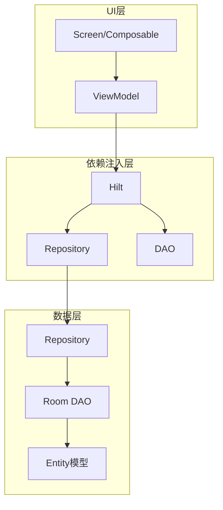
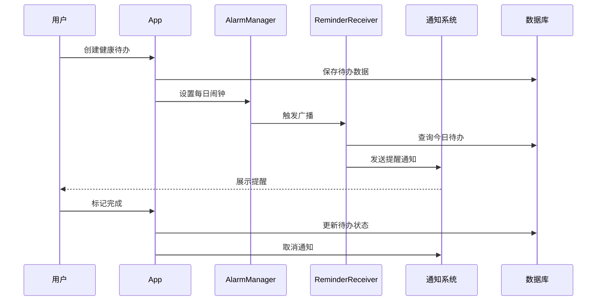
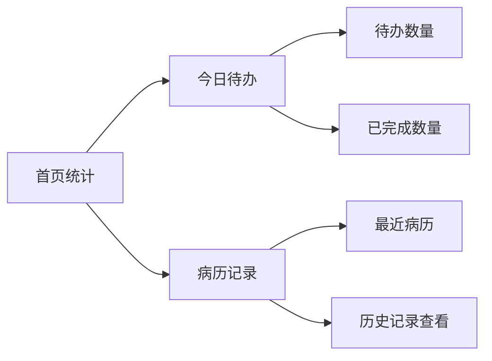
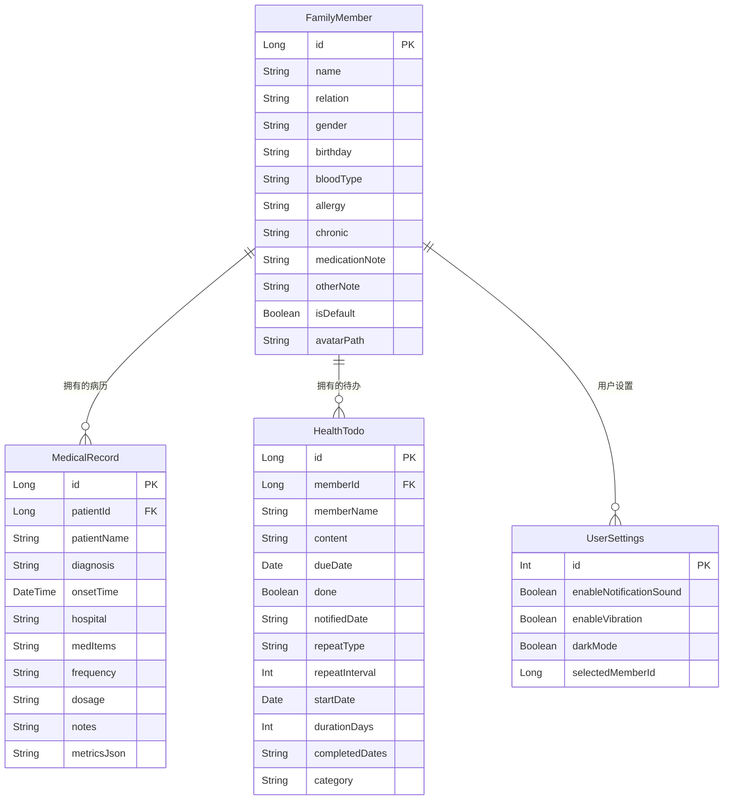
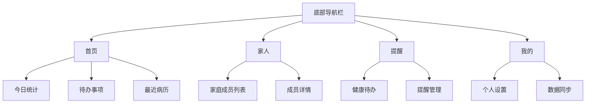

## 1. 项目概述
医迹 (MedTrace) 是一款基于 Android 平台的医疗健康管理应用，主要功能包括：
- 家庭成员管理：支持多成员档案，记录基本信息、过敏史、慢性病等
- 病历记录：记录就诊信息、诊断结果、处方药物、检查指标等
- AI 分析：通过 AI 提取病历中的关键指标，支持健康趋势分析
- 数据安全：应用锁（生物识别/PIN）、加密备份、Gist 同步
- 健康待办提醒：服药、复查、检查等健康任务的提醒与追踪
## 2. 系统架构
### 2.1 技术栈
- 开发语言：Kotlin
- UI 框架：Jetpack Compose
- 数据库：Room
- 依赖注入：Hilt
- 架构模式：MVVM（ViewModel + Repository + Room DAO）
- 后台任务：AlarmManager（每日提醒）+ ReminderReceiver（BroadcastReceiver）
- 系统通知：NotificationManager
- 导航：Navigation Compose
- 序列化：Gson + kotlinx.serialization
### 2.2 架构图

## 3. 核心功能设计
### 3.1 健康待办功能
#### 3.1.1 功能描述

1. **创建健康待办**
- 支持设置待办内容（服药、复查、检查等）
- 可设置截止日期
- 支持设置重复类型（每日、每周等）
- 可配置持续天数
- 支持关联家庭成员

1. **提醒通知**
- 根据设定时间自动发送提醒通知
- 支持声音提醒
- 支持震动提醒
- 未完成时自动重复提醒

1. **待办完成**
- 点击通知可直接标记完成
- 支持在App内标记完成
- 支持连续天数统计
- 可查看完成进度
- 可查看服药状态（已服用/未服用）
- 支持补录历史服药记录 

1. **待办管理**
- 支持暂停/启用待办
- 可修改待办设置
- 支持删除待办
- 可查看所有待办列表
#### 3.1.2 数据模型

**FamilyMember 实体**
```kotlin
@Entity(tableName = "family_members")
data class FamilyMember(
    @PrimaryKey(autoGenerate = true) val id: Long = 0,
    val name: String,
    val relation: String = "",
    val gender: String = "",
    val birthday: String = "",
    val bloodType: String = "",
    val allergy: String = "",
    val chronic: String = "",
    val medicationNote: String = "",
    val otherNote: String = "",
    val isDefault: Boolean = false,
    val avatarPath: String = ""
)
```

**MedicalRecord 实体**
```kotlin
@Entity(tableName = "medical_records")
data class MedicalRecord(
    @PrimaryKey(autoGenerate = true) val id: Long = 0,
    val patientId: Long = 0,
    val patientName: String,
    val diagnosis: String,
    val onsetTime: LocalDateTime,
    val hospital: String = "",
    val medItems: List<MedicationItem> = emptyList(),
    val frequency: String,    // 服药频率
    val dosage: String,       // 用药剂量
    val notes: String = "",
    @ColumnInfo(name = "metrics_json") val metricsJson: String = ""  // AI 解析的检查指标 JSON
)
```

**HealthTodo 实体**
```kotlin
@Entity(tableName = "health_todos")
data class HealthTodo(
    @PrimaryKey(autoGenerate = true) val id: Long = 0,
    val memberId: Long = 0,
    val memberName: String = "",
    val content: String,
    val dueDate: LocalDate,
    val done: Boolean = false,
    val notifiedDate: String = "",
    val repeatType: String = "none",
    val repeatInterval: Int = 1,
    val startDate: LocalDate = LocalDate.now(),
    val durationDays: Int = 0,
    val completedDates: String = "",
    val category: String = "其他"  // 服药/复查/检查/其他
)
```

**UserSettings 实体**
```kotlin
@Entity(tableName = "user_settings")
data class UserSettings(
    @PrimaryKey val id: Int = 1, // 只需要一条记录
    val enableNotificationSound: Boolean = true,
    val enableVibration: Boolean = true,
    val darkMode: Boolean = false,
    val selectedMemberId: Long = 0
)
```

#### 3.1.3 提醒流程


### 3.2 病历记录管理
#### 3.2.1 功能描述

1. **病历记录创建**
- 记录就诊时间和医院信息
- 支持填写诊断结果
- 可记录处方药物信息
- 支持添加检查指标（AI 提取）
- 可添加备注信息

1. **记录管理**
- 支持查看历史病历记录
- 可按时间顺序排序
- 支持搜索特定记录
- 可编辑已有记录
- 支持删除记录
#### 3.2.2 数据展示

#### 3.2.3 页面实现示例

```kotlin
@Composable
fun HomeScreen(
    navController: NavController
) {
    val viewModel: HomeViewModel = hiltViewModel()
    val uiState by viewModel.uiState.collectAsState()
    
    LazyColumn {
        items(uiState.todayTodos) { todo ->
            HealthTodoCard(todo = todo)
        }
    }
}
```
### 3.3 健康趋势功能
#### 3.3.1 功能描述

1. **健康指标分析**
- 通过 AI 提取病历中的检查指标
- 支持查看指标变化趋势
- 可按时间范围筛选

1. **数据可视化**
- 支持图表展示指标变化
- 支持按周/月查看趋势
### 3.4 应用设置
#### 3.4.1 功能描述

1. **通知设置**
- 可设置提醒声音开关
- 支持震动提醒设置

1. **个性化设置**
- 支持深色/浅色主题切换

1. **数据管理**
- 支持数据备份与恢复
- 支持 Gist 同步
## 4. 数据库设计

### 4.1 实体关系图


## 5. 界面设计
### 5.1 整体布局


### 5.2 关键界面说明
#### 5.2.1 页面列表
- **HomeScreen**：首页，展示今日统计、待办事项、最近病历
- **FamilyScreen**：家人管理，家庭成员列表
- **RemindersScreen**：健康待办提醒列表
- **ProfileScreen**：个人中心
- **MedicalRecordScreen**：病历记录列表
- **AddMedicalRecordScreen**：添加/编辑病历
- **SettingsScreen**：应用设置
- **TrendsScreen**：健康趋势分析
- **MemberDetailScreen**：成员详情页
- **LockScreen**：应用锁界面
- **PremiumScreen**：高级功能页面

#### 5.2.2 首页设计
- 顶部显示问候语和设置入口
- 今日待办统计卡片
- 待办事项列表
- 最近病历以卡片形式展示
- 支持下拉刷新更新数据

#### 5.2.3 健康待办界面
- 按日期筛选待办事项
- 待办分类：服药/复查/检查/其他
- 支持标记完成和连续天数统计
- 新增按钮固定在右下角

#### 5.2.4 病历记录界面
- 支持时间轴展示
- 可按成员筛选查看
- 记录卡片包含：
  - 就医时间
  - 医院信息
  - 诊断结果
  - 处方信息
## 7. 技术实现细节

### 7.1 项目依赖

```kotlin
// build.gradle.kts
dependencies {
    // Jetpack Compose
    implementation(libs.androidx.ui)
    implementation(libs.androidx.material3)
    implementation(libs.androidx.material.icons.extended)
    
    // Room
    val roomVersion = "2.6.1"
    implementation("androidx.room:room-runtime:$roomVersion")
    implementation("androidx.room:room-ktx:$roomVersion")
    implementation("androidx.room:room-paging:$roomVersion")
    kapt("androidx.room:room-compiler:$roomVersion")
    
    // Navigation
    implementation("androidx.navigation:navigation-compose:2.8.0")
    
    // WorkManager (for notifications)
    implementation("androidx.work:work-runtime-ktx:2.9.0")
    
    // Hilt
    val hiltVersion = "2.50"
    implementation("com.google.dagger:hilt-android:$hiltVersion")
    kapt("com.google.dagger:hilt-android-compiler:$hiltVersion")
    implementation("androidx.hilt:hilt-navigation-compose:1.1.0")
    
    // Gson
    implementation("com.google.code.gson:gson:2.10.1")
    
    // kotlinx.serialization
    implementation(libs.kotlinx.serialization.json)
    
    // Coroutines
    implementation("org.jetbrains.kotlinx:kotlinx-coroutines-android:1.9.0")
    
    // Lifecycle
    implementation(libs.androidx.lifecycle.runtime.ktx)
    implementation(libs.androidx.lifecycle.viewmodel)
    implementation(libs.androidx.lifecycle.viewmodel.compose)
    
    // Biometric
    implementation(libs.androidx.biometric)
    
    // EncryptedSharedPreferences
    implementation(libs.androidx.security.crypto)
}
```
### 7.2 框架使用规范
#### 7.2.1 Jetpack Compose UI

- 使用 Material3 主题和组件
- 遵循组合函数单一职责原则
- 状态提升到合适的层级
- 使用 remember 和 mutableStateOf 管理状态

```kotlin
@Composable
fun HealthTodoCard(
    todo: HealthTodo,
    modifier: Modifier = Modifier
) {
    Card(
        modifier = modifier
            .fillMaxWidth()
            .padding(8.dp)
    ) {
        Column {
            Text(text = todo.content)
            Text(text = "截止日期: ${todo.dueDate}")
            Text(text = "状态: ${if (todo.done) "已完成" else "待完成"}")
        }
    }
}
```
#### 7.2.2 Room 数据库

- 使用抽象类定义 DAO
- 合理使用事务操作
- 采用 Flow 实现响应式数据更新
- 类型转换器处理复杂数据类型

```kotlin
@Dao
interface MedicalRecordDao {
    @Query("SELECT * FROM medical_records")
    fun getAllRecords(): Flow<List<MedicalRecord>>

    @Query("SELECT * FROM medical_records WHERE patientId = :patientId ORDER BY onsetTime DESC")
    fun getRecordsByMember(patientId: Long): Flow<List<MedicalRecord>>

    @Insert
    suspend fun insert(record: MedicalRecord): Long

    @Update
    suspend fun update(record: MedicalRecord)

    @Delete
    suspend fun delete(record: MedicalRecord)
}
```

#### 7.2.3 后台提醒

- 使用 AlarmManager 设置每日闹钟
- ReminderReceiver 接收广播并触发提醒
- 提醒逻辑：查询今日待办，发送通知

```kotlin
class ReminderReceiver : BroadcastReceiver() {
    override fun onReceive(context: Context, intent: Intent?) {
        if (intent?.action != "com.yy.medtrace.reminder.DAILY") return
        val pendingResult = goAsync()
        val scope = CoroutineScope(SupervisorJob() + Dispatchers.IO)
        scope.launch {
            try {
                val database = AppDatabase.getDatabase(context)
                runCatching { ReminderHelper.maybeNotify(context, database) }
                ReminderHelper.scheduleDaily(context)
            } finally {
                pendingResult.finish()
            }
        }
    }
}
```
### 7.3 代码规范

#### 7.3.1 项目结构

```
app/
├── src/
│   ├── main/
│   │   ├── java/
│   │   │   └── com/yy/medtrace/
│   │   │       ├── data/               # 数据层
│   │   │       │   ├── dao/            # Room DAO
│   │   │       │   ├── model/          # 数据模型
│   │   │       │   └── repository/     # 数据仓库
│   │   │       ├── viewmodel/          # ViewModel 层
│   │   │       ├── di/                 # Hilt 依赖注入
│   │   │       ├── reminder/           # 提醒相关
│   │   │       ├── navigation/         # 导航配置
│   │   │       ├── ui/                 # 界面层
│   │   │       │   ├── components/     # 可复用组件
│   │   │       │   ├── screens/        # 页面
│   │   │       │   └── theme/          # 主题
│   │   │       └── util/               # 工具类
│   │   └── res/                        # 资源文件
│   └── test/                           # 测试代码
└── build.gradle.kts                    # 构建配置
```

#### 7.3.2 命名规范

- 类名：大驼峰命名法（PascalCase）
- 函数名：小驼峰命名法（camelCase）
- 常量：全大写下划线分隔（SNAKE_CASE）
- 资源文件：小写下划线分隔（snake_case）
#### 7.3.3 注释规范

- 类和公共方法必须添加文档注释
- 复杂逻辑需要添加行内注释
- 使用 TODO 标记待完成的任务
- 弃用的代码使用 @Deprecated 注解
### 7.4 性能优化
#### 7.4.1 Compose优化

- 使用 remember 避免不必要的重组
- LazyColumn 替代 Column 加载列表
- 合理使用 derivedStateOf 计算派生状态
- key 参数确保正确的重组范围
#### 7.4.2 数据库优化

- 索引优化常用查询字段
- 使用 EXPLAIN QUERY PLAN 分析查询性能
- 避免主线程进行数据库操作
- 合理使用事务减少IO操作
#### 7.4.3 后台任务优化

- 设置合适的任务执行条件
- 避免频繁调度重复任务
- 合理设置任务重试策略
- 监控任务执行状态和性能
### 7.5 框架集成规范

#### 7.5.1 本地框架优先原则

- 优先使用项目中已有的框架和组件
- 遵循框架原有的设计模式和使用方式
- 保持与现有代码风格的一致性
- 复用已有的工具类和扩展函数
#### 7.5.2 框架API使用规范

- 使用框架提供的标准API
- 避免自定义实现已有功能
- 遵循框架的最佳实践指南
- 及时更新框架版本修复安全问题
