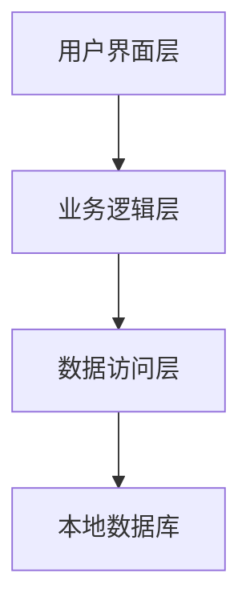
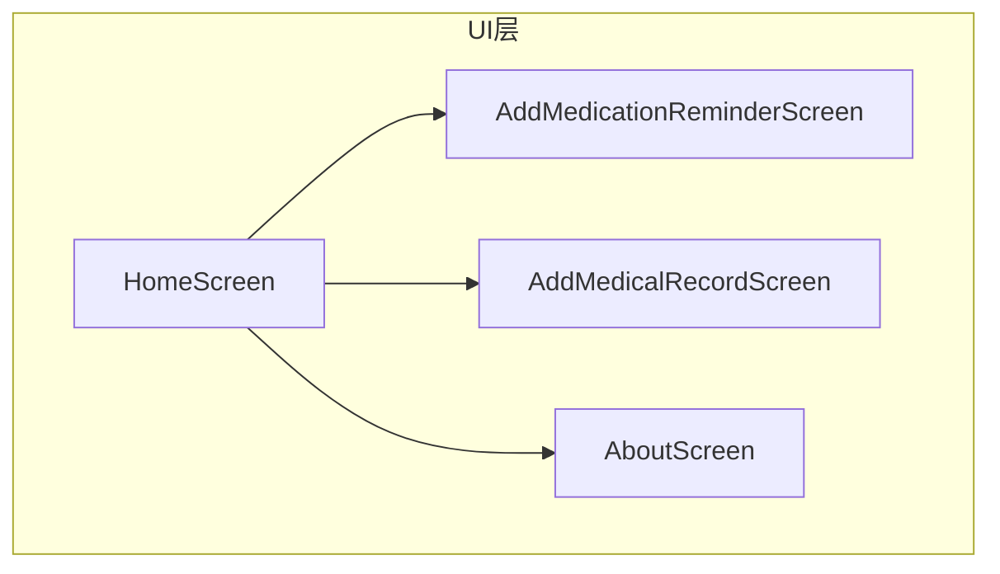
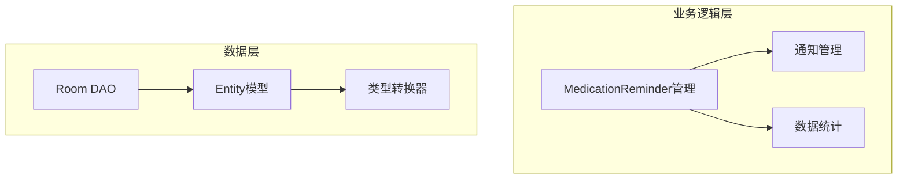
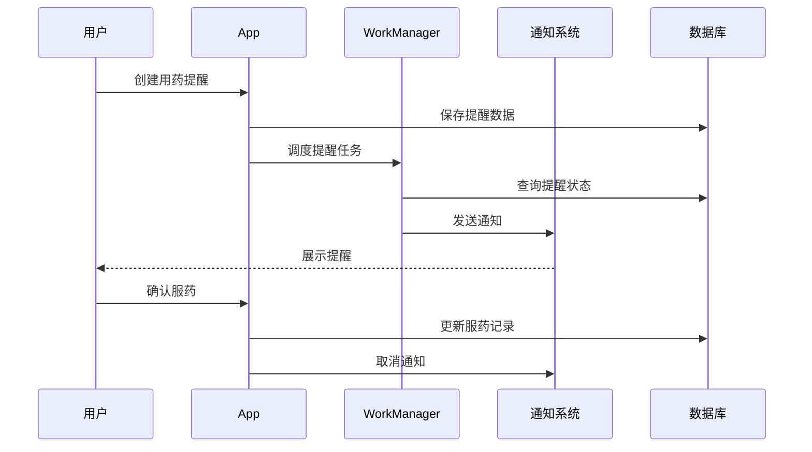
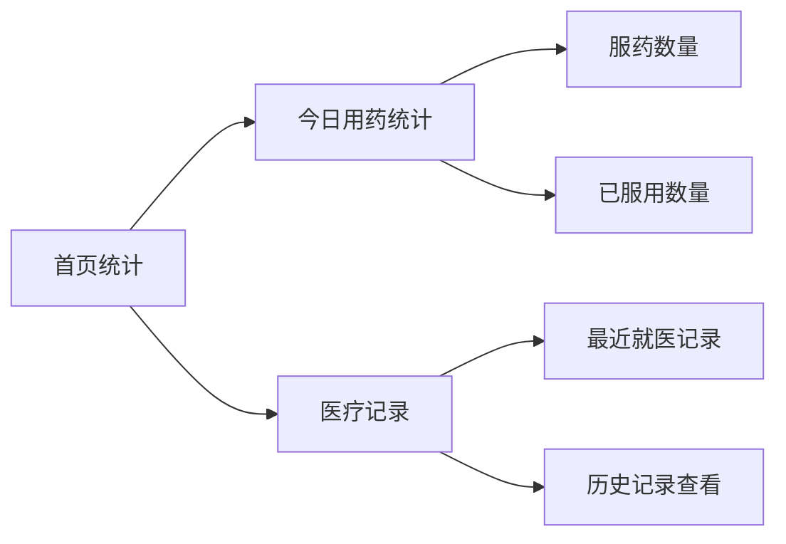
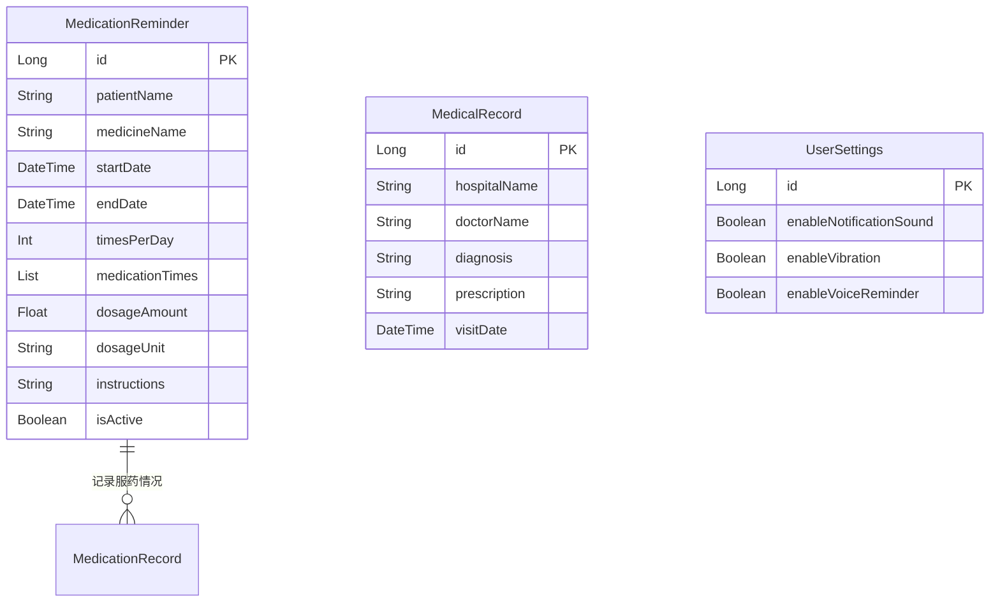
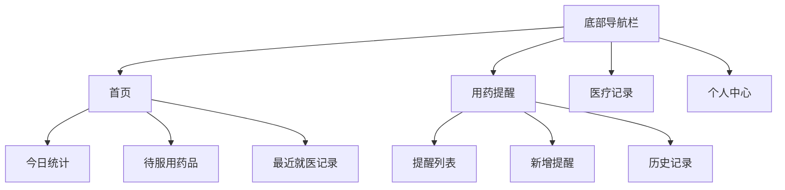

## 1. 项目概述
智药乐是一款基于 Android 平台的用药提醒和医疗记录管理应用。主要功能包括用药提醒、医疗记录管理和用药统计。
## 2. 系统架构
### 2.1 技术栈
- 开发语言：Kotlin
- UI框架：Jetpack Compose
- 数据库：Room
- 后台任务：WorkManager
- 系统通知：NotificationManager
### 2.2 架构图





## 3. 核心功能设计
### 3.1 用药提醒功能
#### 3.1.1 功能描述

1. **创建用药提醒**
- 支持设置患者姓名、药品名称
- 可设置服药起止时间
- 支持设置每日服药次数和具体时间点
- 可配置每次服用剂量和单位
- 可添加服药说明（如饭前/饭后服用）

1. **提醒通知**
- 根据设定时间自动发送提醒通知
- 支持声音提醒
- 支持震动提醒
- 支持语音提醒
- 未服药时自动重复提醒（30秒间隔）

 1. **服药确认**
- 点击通知可直接确认服药
- 支持在App内确认服药
- 可查看服药状态（已服用/未服用）
- 支持补录历史服药记录 

1. **提醒管理**
- 支持暂停/启用提醒
- 可修改提醒设置
- 支持删除提醒
- 可查看所有提醒列表
#### 3.1.2 数据模型

```kotlin
@Entity(tableName = "medication_reminders")

data class MedicationReminder(

@PrimaryKey(autoGenerate = true)

val id: Long = 0,

val patientName: String, // 患者姓名

val medicineName: String, // 药品名称

val startDate: LocalDateTime, // 开始服药日期

val endDate: LocalDateTime, // 结束服药日期

val timesPerDay: Int, // 每天服用次数

val medicationTimes: List<LocalTime>, // 每天的服药时间点列表

val dosageAmount: Float, // 每次服用数量

val dosageUnit: String, // 剂量单位

val instructions: String = "", // 服药说明

val isActive: Boolean = true, // 是否启用提醒

var scheduledTime: LocalDateTime = LocalDateTime.now()

)

```

#### 3.1.3 提醒流程


### 3.2 医疗记录管理
#### 3.2.1 功能描述

1. **就医记录创建**
- 记录就医时间和医院信息
- 支持填写医生姓名
- 可记录诊断结果
- 支持添加处方信息
- 可上传相关医疗文件

1. **记录管理**
- 支持查看历史就医记录
- 可按时间顺序排序
- 支持搜索特定记录
- 可编辑已有记录
- 支持删除记录
#### 3.2.2 数据统计展示

#### 3.2.3 主页面实现

```kotlin

@Composable

fun HomeScreen(

database: AppDatabase,

navController: NavController

) {

// 统计数据

data class MedicationStats(

val totalToday: Int = 0,

val completedToday: Int = 0,

val takenDosesToday: Int = 0

)

// 数据加载和统计逻辑

LaunchedEffect(Unit) {

combine(

database.medicationReminderDao().getTodayReminders(now),

database.medicationRecordDao().getAll()

) { reminders, records ->

// 计算用药统计

val totalDoses = reminders.sumOf { it.timesPerDay }

val todayRecords = records.filter {

it.scheduledTime.toLocalDate() == now.toLocalDate()

}

val takenDosesToday = todayRecords.count {

it.status == MedicationStatus.TAKEN

}

}

}

}
```
### 3.3 用药统计功能
#### 3.3.1 功能描述

1. **今日用药统计**
- 显示今日应服用药品总数
- 统计已服用药品数量
- 实时更新服药状态

1. **历史用药分析**
- 支持按周/月查看服药情况
### 3.4 系统设置
#### 3.4.1 功能描述

1. **提醒设置**
- 可设置提醒声音开关
- 支持震动提醒设置
- 可配置语音提醒
- 设置提醒重复间隔
1. **个性化设置**
- 支持深色/浅色主题切换
- 可设置字体大小
- 支持多语言切换
- 可自定义提醒铃声
## 4. 数据库设计

### 4.1 实体关系图


## 5. 界面设计
### 5.1 整体布局


### 5.2 关键界面说明
#### 5.2.1 首页设计

- 顶部显示问候语和设置入口
- 今日用药统计卡片采用醒目的主题色
- 待服用药品列表支持左滑确认服用
- 最近就医记录以卡片形式展示
- 支持下拉刷新更新数据
#### 5.2.2 用药提醒界面
- 采用日历视图展示提醒
- 支持按时间段筛选
- 新增按钮固定在右下角
- 提醒卡片显示关键信息：
- 药品名称和剂量
- 服用时间
- 服用说明
- 状态标识
#### 5.2.3 医疗记录界面
- 支持时间轴展示
- 可按医院/科室分类查看
- 处方图片支持预览
- 记录卡片包含：
- 就医时间
- 医院信息
- 诊断结果
- 处方链接
## 7. 技术实现细节

### 7.1 项目依赖

```kotlin

// build.gradle.kts

dependencies {

// Jetpack Compose

implementation("androidx.compose.ui:ui:${Versions.compose}")

implementation("androidx.compose.material3:material3:${Versions.material3}")

implementation("androidx.compose.runtime:runtime:${Versions.compose}")

// Room数据库

implementation("androidx.room:room-runtime:${Versions.room}")

implementation("androidx.room:room-ktx:${Versions.room}")

kapt("androidx.room:room-compiler:${Versions.room}")

// WorkManager

implementation("androidx.work:work-runtime-ktx:${Versions.work}")

// 协程

implementation("org.jetbrains.kotlinx:kotlinx-coroutines-android:${Versions.coroutines}")

// 生命周期组件

implementation("androidx.lifecycle:lifecycle-runtime-ktx:${Versions.lifecycle}")

implementation("androidx.lifecycle:lifecycle-viewmodel-compose:${Versions.lifecycle}")

}

```
### 7.2 框架使用规范
#### 7.2.1 Jetpack Compose UI

- 使用 Material3 主题和组件
- 遵循组合函数单一职责原则
- 状态提升到合适的层级
- 使用 remember 和 mutableStateOf 管理状态

```kotlin

@Composable

fun ReminderCard(

reminder: MedicationReminder,

modifier: Modifier = Modifier

) {

var expanded by remember { mutableStateOf(false) }

Card(

modifier = modifier

.fillMaxWidth()

.clickable { expanded = !expanded }

) {

// Card content

}

}

```
#### 7.2.2 Room 数据库

- 使用抽象类定义 DAO
- 合理使用事务操作
- 采用 Flow 实现响应式数据更新
- 类型转换器处理复杂数据类型
```kotlin

@Dao

interface MedicationReminderDao {

@Query("SELECT * FROM medication_reminders WHERE date(scheduledTime) = date('now')")

fun getTodayReminders(): Flow<List<MedicationReminder>>

@Transaction

suspend fun updateReminderAndRecord(reminder: MedicationReminder) {

updateReminder(reminder)

insertRecord(MedicationRecord(reminderId = reminder.id))

}

}

```

#### 7.2.3 WorkManager

- 使用 CoroutineWorker 处理后台任务
- 合理设置任务执行条件
- 实现任务链和并行任务
- 处理任务失败和重试

```kotlin

class ReminderWorker(

context: Context,

params: WorkerParameters

) : CoroutineWorker(context, params) {

override suspend fun doWork(): Result {

// 实现提醒逻辑

return try {

// 发送通知

Result.success()

} catch (e: Exception) {

Result.retry()

}

}

}

```
### 7.3 代码规范

#### 7.3.1 项目结构

```

app/

├── src/

│ ├── main/

│ │ ├── java/

│ │ │ └── com/yy/chiyaole/

│ │ │ ├── data/ // 数据层

│ │ │ │ ├── dao/ // 数据访问对象

│ │ │ │ ├── model/ // 数据模型

│ │ │ │ └── repository/ // 数据仓库

│ │ │ ├── ui/ // 界面层

│ │ │ │ ├── components/ // 可复用组件

│ │ │ │ ├── screens/ // 页面

│ │ │ │ └── theme/ // 主题

│ │ │ ├── util/ // 工具类

│ │ │ └── worker/ // 后台任务

│ │ └── res/ // 资源文件

│ └── test/ // 测试代码

└── build.gradle.kts // 构建配置

```

#### 7.3.2 命名规范

- 类名：大驼峰命名法（PascalCase）
- 函数名：小驼峰命名法（camelCase）
- 常量：全大写下划线分隔（SNAKE_CASE）
- 资源文件：小写下划线分隔（snake_case）
#### 7.3.3 注释规范

- 类和公共方法必须添加文档注释
- 复杂逻辑需要添加行内注释
- 使用 TODO 标记待完成的任务
- 弃用的代码使用 @Deprecated 注解
### 7.4 性能优化
#### 7.4.1 Compose优化

- 使用 remember 避免不必要的重组
- LazyColumn 替代 Column 加载列表
- 合理使用 derivedStateOf 计算派生状态
- key 参数确保正确的重组范围
#### 7.4.2 数据库优化

- 索引优化常用查询字段
- 使用 EXPLAIN QUERY PLAN 分析查询性能
- 避免主线程进行数据库操作
- 合理使用事务减少IO操作
#### 7.4.3 后台任务优化

- 设置合适的任务执行条件
- 避免频繁调度重复任务
- 合理设置任务重试策略
- 监控任务执行状态和性能
### 7.5 框架集成规范

#### 7.5.1 本地框架优先原则

- 优先使用项目中已有的框架和组件
- 遵循框架原有的设计模式和使用方式
- 保持与现有代码风格的一致性
- 复用已有的工具类和扩展函数
#### 7.5.2 框架API使用规范

- 使用框架提供的标准API
- 避免自定义实现已有功能
- 遵循框架的最佳实践指南
- 及时更新框架版本修复安全问题
