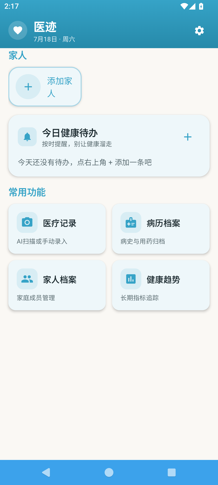
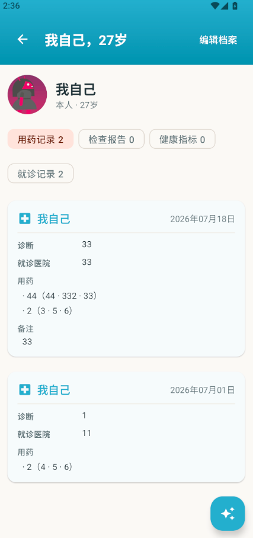
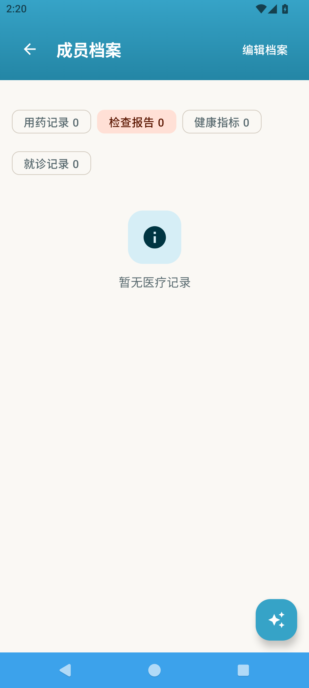
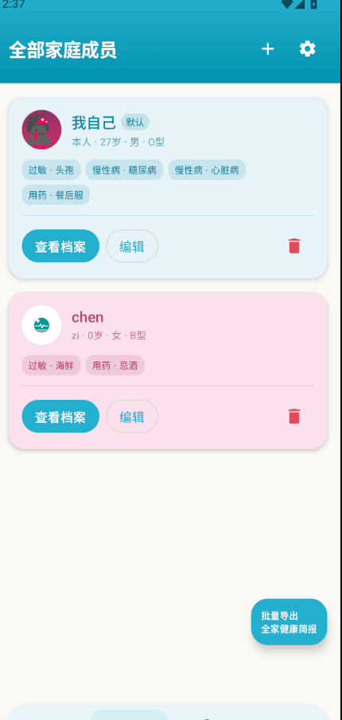
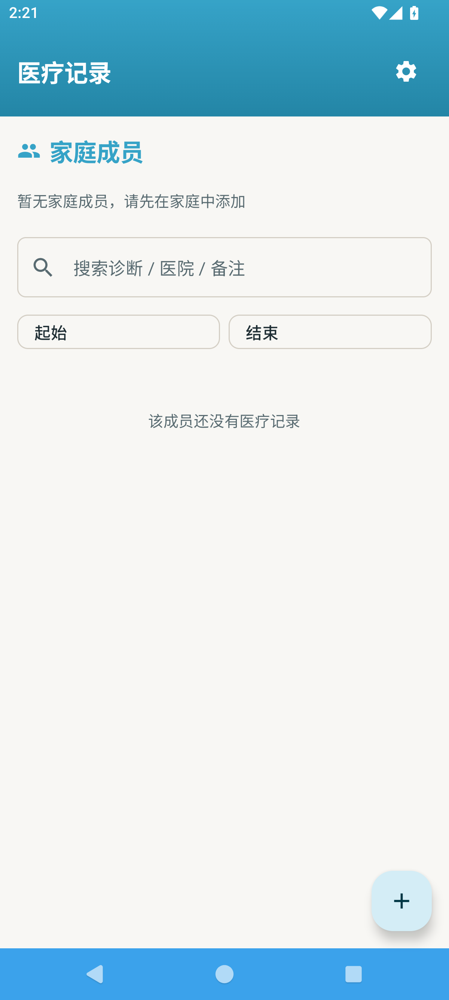
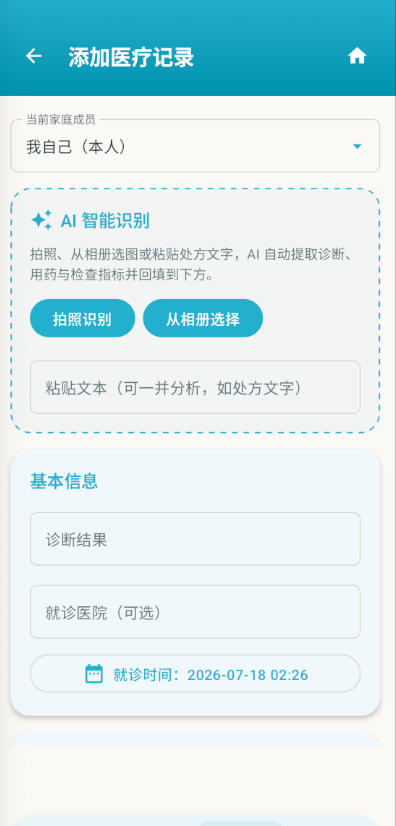
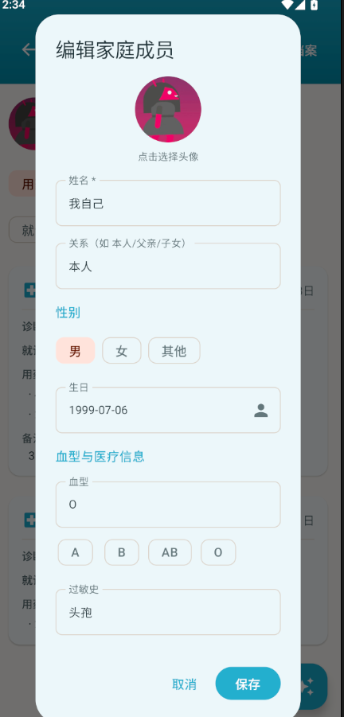
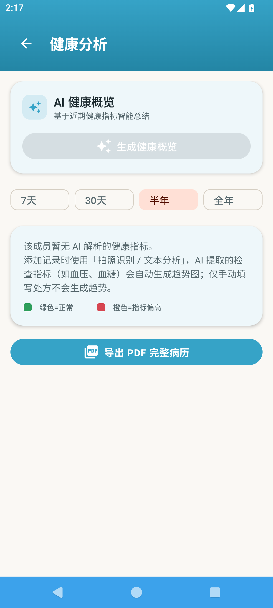
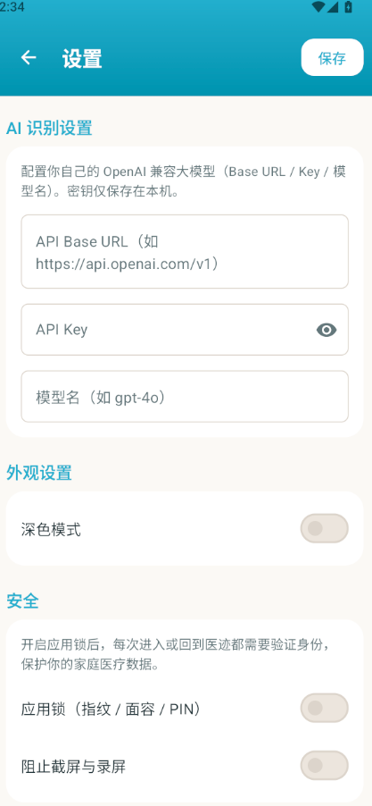

# 医迹 · 使用说明与演示

> 医迹（ChiYaoLe）是一款为家庭设计的医疗记录与健康管理 App。本文档面向初次使用的用户，按页面顺序介绍各功能与操作路径，并配以实机截图。

---

## 0. 登录与首页入口

首次启动会进入引导页（仅一次），之后每次打开显示约 2.5 秒的开屏动画，随后进入 **首页**。底部为四个主入口：**首页 / 家人档案 / 新增记录 / 健康分析**，右上角齿轮进入 **设置**。

---

## 1. 首页（Home）

首页自上而下分为四块：

- **顶栏**：左侧「医迹」 logo 标记与标题，右侧显示当天日期。
- **今日健康待办**：列出当天计划的健康事项（如服药、复诊）。点击右上角「＋」可新增待办，弹窗内填写内容并可选择计划日期；列表项可勾选完成或左滑删除。
- **常用功能磁贴**：四个固定磁贴，点击分别跳转：
  - 医疗记录 → 新增记录页
  - 病历档案 → 病历列表
  - 家人档案 → 家人列表
  - 健康趋势 → 趋势分析
- **家人卡片**：横向滑动展示家庭成员。每张卡片左侧为成员头像，右侧为姓名、关系与年龄，底部为派生标签（用药 / 检查 / 指标 / 就诊）。卡片右侧有渐隐提示，表示可继续横滑。点击卡片进入成员详情。

> 操作路径：启动即首页；点磁贴或家人卡片进入对应页面。

---

## 2. 成员详情（Member Detail）

进入某位成员后，页面顶部显示 **头像、姓名、关系、年龄**，右上角「编辑档案」可直接修改该成员信息（见第 6 节）。

中部为 **分类标签**，以流式布局展示四种记录类型：

- 用药
- 检查
- 指标
- 就诊

点击标签即可筛选该成员对应类型的记录。例如进入时预选「检查」标签：

> 操作路径：首页点家人卡片 → 成员详情；点顶部标签切换记录类型。

---

## 3. 全部家庭成员（Family）

「家人档案」 Tab 展示家庭所有成员列表，每位成员以头像卡呈现，并显示关系与年龄。点击成员进入详情；点击「添加家人」可新增成员并为其设置头像。

> 操作路径：底部「家人档案」 → 查看 / 添加成员。

---

## 4. 病历档案列表（Medical Records）

「病历档案」磁贴进入后，按成员与时间展示全部医疗记录，包含就诊医院、诊断、用药等信息，便于回顾与整理。点击单条记录可查看或编辑详情。

> 操作路径：首页「病历档案」磁贴 → 病历列表。

---

## 5. 新增医疗记录（Add Record）

新增记录页支持 **AI 识别**：粘贴或输入病历文本后，系统可自动抽取医院、诊断、用药、频次、剂量等字段并填充表单，减少手动录入。页面顶部「当前家庭成员」下拉用于选择记录归属人（唯一选择器）。

> 操作路径：底部「＋ 新增记录」或首页「医疗记录」磁贴 → 填写 / AI 识别 → 保存。

---

## 6. 编辑成员与头像（Edit Dialog）

在成员详情页点击「编辑档案」，或直接新增家人时，会弹出编辑弹窗：

弹窗内可修改姓名、关系、年龄等，并支持 **从相册选择头像**——选定后头像会同步显示在首页卡片、详情页、家人列表与选择器中。

> 操作路径：成员详情「编辑档案」 → 修改信息 → 点头像区域从相册选图 → 保存。

---

## 7. 健康趋势分析（Trends）

「健康分析」 Tab 以图表形式展示成员的健康指标趋势，帮助直观了解一段时间内的身体变化情况。

> 操作路径：底部「健康分析」 → 查看趋势图。

---

## 8. 设置（Settings）

设置页提供应用偏好与数据管理，包括：

- 深色模式开关
- 应用锁（密码 / 生物识别）
- 数据备份与恢复
- 关于

> 操作路径：首页右上角齿轮 → 设置。

---

## 附：页面速查表

| 页面 | 进入方式 |
| --- | --- |
| 首页 | 启动后默认 |
| 成员详情 | 首页点家人卡片 |
| 全部家庭成员 | 底部「家人档案」 |
| 病历档案 | 首页「病历档案」磁贴 |
| 新增记录 | 底部「＋」/ 首页「医疗记录」磁贴 |
| 编辑成员 | 成员详情「编辑档案」 |
| 健康趋势 | 底部「健康分析」 |
| 设置 | 首页右上角齿轮 |
